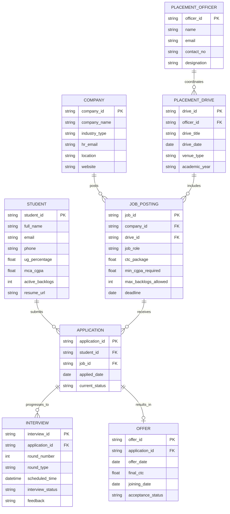

```mermaid
erDiagram
    STUDENT ||--o{ APPLICATION : submits
    JOB_POSTING ||--o{ APPLICATION : receives
    COMPANY ||--o{ JOB_POSTING : posts
    PLACEMENT_DRIVE ||--o{ JOB_POSTING : includes
    APPLICATION ||--o{ INTERVIEW : progresses_to
    APPLICATION ||--o| OFFER : results_in
    PLACEMENT_OFFICER ||--o{ PLACEMENT_DRIVE : coordinates

    STUDENT {
        string student_id PK
        string full_name
        string email
        string phone
        float ug_percentage
        float mca_cgpa
        int active_backlogs
        string resume_url
    }

    COMPANY {
        string company_id PK
        string company_name
        string industry_type
        string hr_email
        string location
        string website
    }

    PLACEMENT_OFFICER {
        string officer_id PK
        string name
        string email
        string contact_no
        string designation
    }

    PLACEMENT_DRIVE {
        string drive_id PK
        string officer_id FK
        string drive_title
        date drive_date
        string venue_type
        string academic_year
    }

    JOB_POSTING {
        string job_id PK
        string company_id FK
        string drive_id FK
        string job_role
        float ctc_package
        float min_cgpa_required
        int max_backlogs_allowed
        date deadline
    }

    APPLICATION {
        string application_id PK
        string student_id FK
        string job_id FK
        date applied_date
        string current_status
    }

    INTERVIEW {
        string interview_id PK
        string application_id FK
        int round_number
        string round_type
        datetime scheduled_time
        string interview_status
        string feedback
    }

    OFFER {
        string offer_id PK
        string application_id FK
        date offer_date
        float final_ctc
        date joining_date
        string acceptance_status
    }
```
